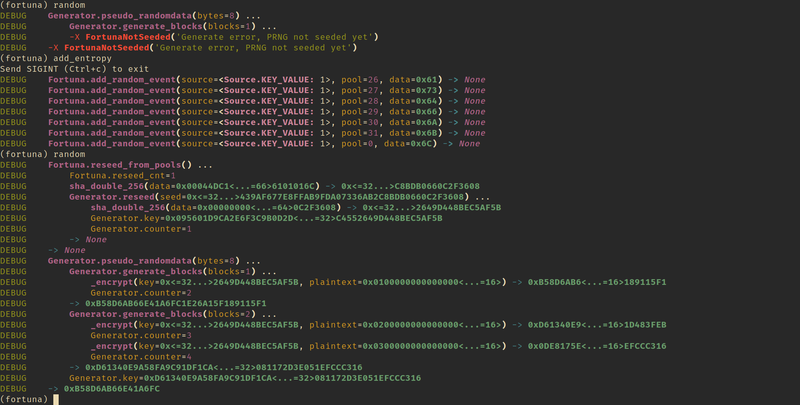

A didactic and minimal implementation of the Fortuna cryptographically secure pseudorandom number generator.


```
$ pip install .
$ python example.py
(fortuna)
(fortuna) help

Documented commands (type help <topic>):
========================================
add_entropy  help  random

Undocumented commands:
======================
EOF  print_pools  print_seed_file  update_seed_file

(fortuna)
```

In your terminal, a colored tracing will be displayed:



The example has only been tested on Linux, but it should work on macOS as well.

## Learn specification

- https://en.wikipedia.org/wiki/Fortuna_(PRNG)
- https://www.schneier.com/academic/paperfiles/fortuna.pdf This is a chapter
  part of the book `Cryptography Engineering`. Previous chapters will help you
  to understand this one.

## Other implementations

- https://github.com/otms61/fortuna
  The base of this project but it seems unmaintained.
- https://github.com/seehuhn/fortuna
  - Interface for entropy sources is easier for user/application.
- [pycrypto/Fortuna](https://github.com/pycrypto/pycrypto/tree/65b43bd4ffe2a48bdedae986b1a291f5a2cc7df7/lib/Crypto/Random/Fortuna)
  - pycrypto/lib/Crypto/Random/Fortuna/
    - FortunaAccumulator.py
    - FortunaGenerator.py
    - SHAd256.py
  - [SelfTest/Random/Fortuna](https://github.com/pycrypto/pycrypto/tree/65b43bd4ffe2a48bdedae986b1a291f5a2cc7df7/lib/Crypto/SelfTest/Random/Fortuna)
    - test_FortunaAccumulator.py
    - test_FortunaGenerator.py
    - test_SHAd256.py
- https://github.com/freebsd/freebsd-src/blob/main/sys/dev/random/fortuna.c
